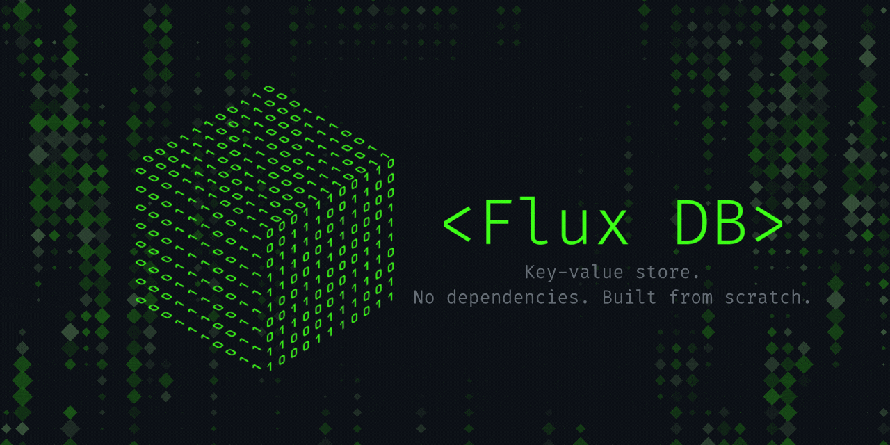
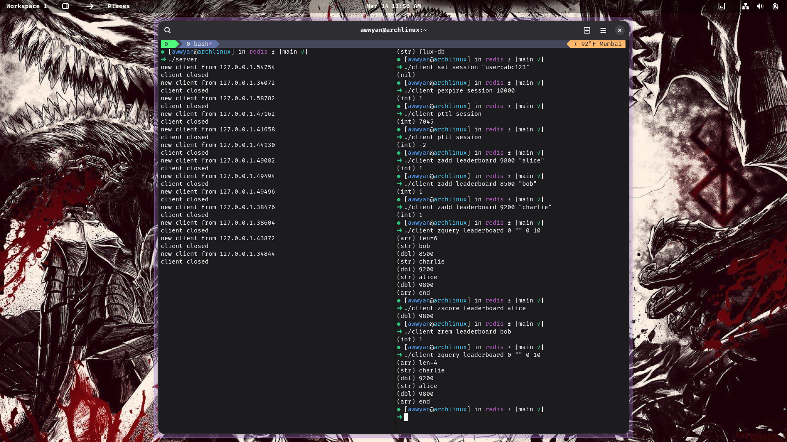

<div align="center">


 
# Flux DB
 
*A Redis-inspired key-value store, built from scratch in C++17.*
 
</div>

Every data structure is implemented by hand, no external dependencies.

The server handles multiple concurrent clients over TCP using a non-blocking, event-driven loop with `poll()`. A background thread pool handles slow work like large deletions and AOF flushing without stalling the main loop. Data survives restarts via an append-only file (AOF).

**Supported commands:** `get` · `set` · `del` · `keys` · `pexpire` · `pttl` · `zadd` · `zrem` · `zscore` · `zquery`

---

## Demo

> 📹 _Terminal recording_
>
> 

> 🖼️ _Screenshots_
>
> 
> *SET · GET · TTL expiry · sorted set operations across a live server/client session*
> 
> 
> *Keys restored on startup via AOF replay*
---

## How It Works

- **Incremental rehashing** - [`hashtable.cpp`](hashtable.cpp) maintains two hash tables simultaneously during resize. On each insert or lookup, it migrates a fixed batch of 128 keys from the old table to the new one, avoiding the latency spike of a full stop-the-world rehash.

- **[`container_of` macro](https://en.wikipedia.org/wiki/Offsetof)** - used throughout to recover a pointer to an enclosing struct from a pointer to an embedded member (e.g. `HNode`, `AVLNode`). This enables intrusive data structures where nodes carry no heap allocation of their own.

- **Intrusive linked list for idle timeouts** - [`list.h`](include/list.h) implements a doubly-linked list embedded directly into `Conn`. The server keeps connections sorted by last-active time so idle timeout checks are O(1): just inspect the head of the list.

- **Min-heap with stable back-references** - [`heap.cpp`](heap.cpp) stores a `size_t *ref` pointer alongside each heap value. When an item moves during sift-up or sift-down, it updates the back-reference in the owning `Entry`. This makes heap deletion by arbitrary position O(log n) without a secondary lookup.

- **Dual-timer design** - [`server.cpp`](server.cpp) uses two different timer mechanisms for two different purposes: a sorted linked list for idle connection timeouts (naturally ordered by insertion), and a min-heap for TTL expiry (arbitrary future times). The `next_timer_ms()` function checks both and passes the nearest deadline to `poll()`.

- **Non-blocking I/O with `poll()`** - the server uses [`fcntl` with `O_NONBLOCK`](https://man7.org/linux/man-pages/man2/fcntl.2.html) on all sockets and a single [`poll()`](https://man7.org/linux/man-pages/man2/poll.2.html) loop to multiplex reads, writes, and error conditions across all connections without threads.

- **Deferred deletion via thread pool** - large sorted sets (`ZSet` with over 1,000 entries) are deleted in a background thread to avoid stalling the event loop. Small structures are freed inline to avoid unnecessary context switches.

- **AOF with two-phase durability** - [`aof.cpp`](aof.cpp) calls `fflush()` to drain the stdio buffer to the kernel, then `fsync()` to flush the kernel buffer to disk. The fsync is queued to the thread pool once per second to avoid blocking the main loop.

- **Sorted set implemented as AVL + hash map** - [`zset.cpp`](zset.cpp) maintains two parallel indexes per sorted set: an AVL tree keyed by `(score, name)` for range queries, and a hash map keyed by name for O(1) point lookups. Both share the same `ZNode` through embedded struct members.

- **`avl_offset` for O(log n) rank navigation** - [`avl.cpp`](avl.cpp) uses subtree size counts stored in each `AVLNode` to jump to any node by rank offset in O(log n) time, regardless of offset distance. This is used in `zquery` to support paginated range queries.

---

## Non-Obvious Technologies

- **[pthreads](https://man7.org/linux/man-pages/man7/pthreads.7.html)** - the thread pool in [`thread_pool.cpp`](thread_pool.cpp) uses `pthread_mutex_t` and `pthread_cond_t` directly rather than C++ `<thread>` or `<mutex>`. Workers block on a condition variable until work is enqueued.

- **[`poll(2)`](https://man7.org/linux/man-pages/man2/poll.2.html)** - used instead of `select` or `epoll`. Simpler to set up than `epoll` and portable across POSIX systems, at the cost of O(n) scan per wake-up.

- **[`CLOCK_MONOTONIC` via `clock_gettime`](https://man7.org/linux/man-pages/man2/clock_gettime.2.html)** - used for all timer logic instead of wall-clock time, so the server is immune to system time adjustments.

- **[AddressSanitizer and UBSan](https://clang.llvm.org/docs/AddressSanitizer.html)** - the `debug` Makefile target compiles with `-fsanitize=address,undefined` for catching memory errors and undefined behavior during development.

- **Python test harness** - [`tests/test_cmds.py`](tests/test_cmds.py) encodes expected client/server interactions as an inline shell-script-style transcript, then drives the compiled `client` binary with `subprocess` and diffs output.

---

## Installation

**Docker (recommended):**
```bash
docker pull awwyan/fluxdb
docker run -p 1234:1234 awwyan/fluxdb
```

**Binary (Linux x86_64):**

Download the latest release from the [releases page](https://github.com/ovenpickled/flux-db/releases).
```bash
tar -xzf fluxdb-v1.0.0-linux-x86_64.tar.gz
./server
```

**Build from source:**
```bash
git clone https://github.com/ovenpickled/flux-db
cd flux-db
make
./server
```

Once the server is running on port 1234, use the client to connect:
```bash
./client set foo bar
./client get foo
```

## Benchmarks

Benchmarked on localhost using a custom pipelined benchmark tool
(pipeline depth 32, 50,000 requests per operation).

| Operation | Throughput    | p50  | p99   |
|-----------|--------------|------|-------|
| SET       | 150k ops/sec | ~1µs | 84µs  |
| GET       | 110k ops/sec | ~1µs | 195µs |
| ZADD      | 149k ops/sec | ~1µs | 85µs  |
| ZSCORE    | 134k ops/sec | ~1µs | 77µs  |

93-99% of requests complete under 100µs.
SET includes AOF persistence overhead (fsync every second).

Environment: Arch Linux, Intel(R) Core(TM) i5-9300HF CPU @ 2.40GHz, single-threaded event loop.

---

## Project Structure

```
ovenpickled-flux-db/
├── server.cpp
├── client.cpp
├── aof.cpp
├── avl.cpp
├── hashtable.cpp
├── heap.cpp
├── zset.cpp
├── thread_pool.cpp
├── Makefile
├── LICENSE
├── include/
├── tests/
└── docs/
```

**`include/`** - headers for all modules. `list.h` and `common.h` are header-only.

**`tests/`** - three C++ unit test binaries (`test_avl`, `test_heap`, `test_offset`) and one Python integration test (`test_cmds.py`) that runs commands against a live server/client pair.

---

## License

MIT - see [LICENSE](LICENSE).
